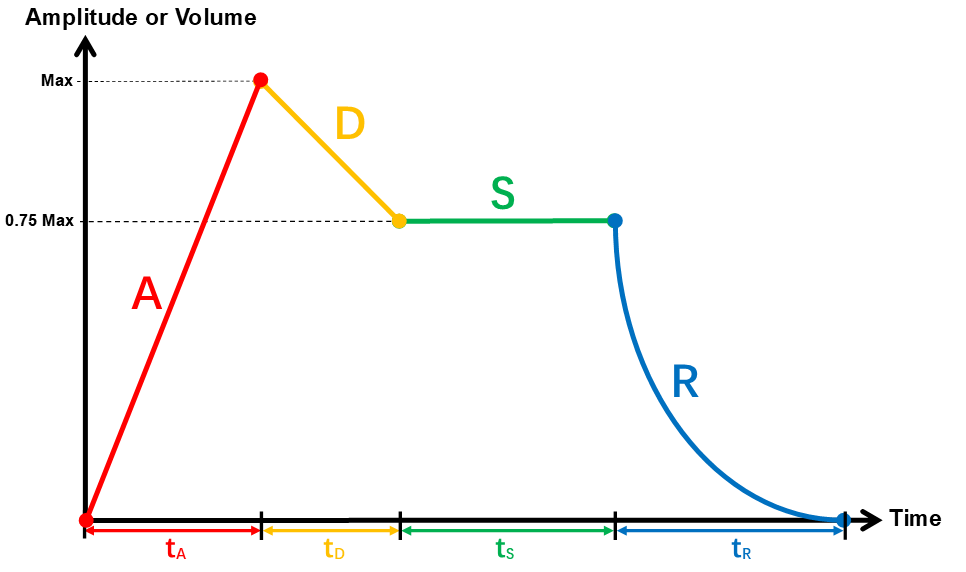
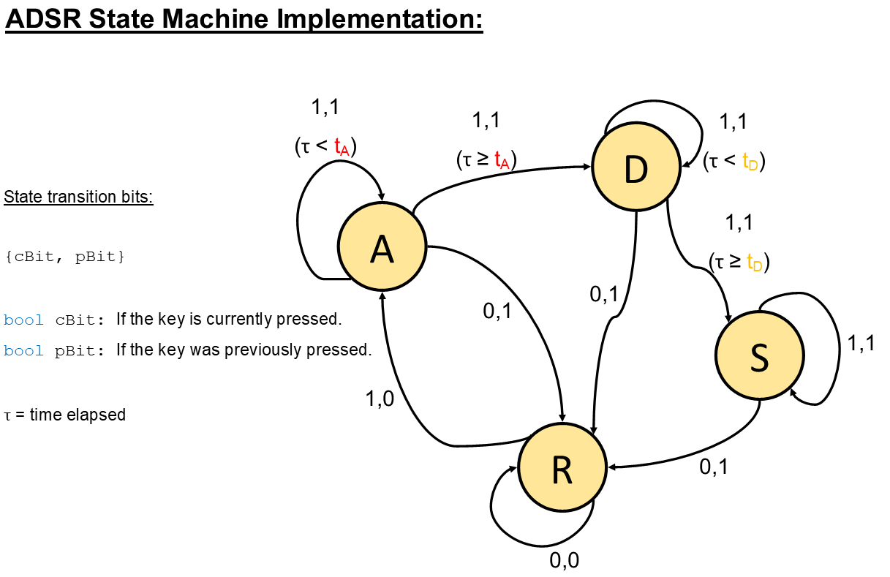
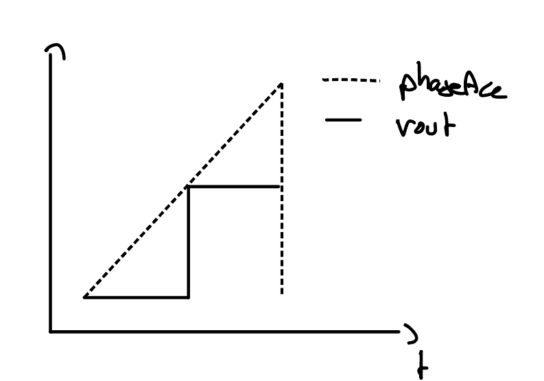
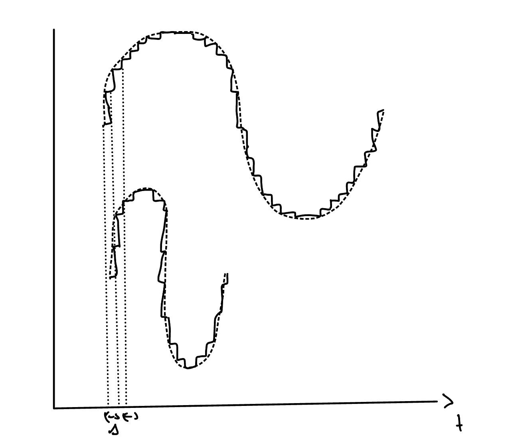
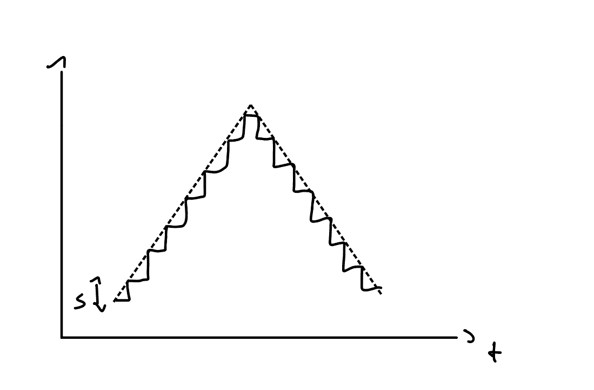

DOCUMENTATION
=============================

Table of Contents
-----------------------------

1. [Introduction](#1-introduction)  
2. [Features](#2-features)  
    2.1. [Core Features](#21-core-features)      
    2.2. [Advanced Features](#22-advanced-features)  
3. [Tasks](#3-tasks)  
    3.1. [scanKeyTask](#31-scankeytask)  
    3.2. [displayUpdateTask](#32-displayupdatetask)    
    3.3. [sampleISR](#33-sampleisr)    
    3.4. [CAN_TX_Task](#34-can\_tx\_task)  
    3.5. [CAN_RX_Task](#35-can\_rx\_task)  
    3.6. [CAN_TX_ISR](#36-can\_tx\_isr)  
    3.7. [CAN_RX_ISR](#37-can\_rx\_isr)  
4. [Analysis](#4-analysis)   
5. [References](#5-references)  

<!-- [0.0. Test Test](#00-test-test)
### 0.0. Test Test -->

&nbsp;  
## 1. Introduction 
<!-- &nbsp;   -->

This project surrounds the embedded software used to program a ST NUCLEO-L432KC microcontroller to control a music synthesiser. Several real-time programming and system analysis techniques were utilised to enable the successful implementation of various different features for the keyboard embedded system, outlined in this documentation.

&nbsp;  

> **Technical specification:** The microntroller contains a STM32L432KCU6U processor, which has an Arm Cortex-M4 core. Each keyboard module covers an octave such that the inputs are 12 keys, 4 control knobs and a joystick. The outputs are 2 channels of audio and an OLED display. Multiple keyboard modules are also able to be connected and stacked together through communication via a CAN bus.
>
> Existing resources used:
>
>- Libraries: STM32duino FreeRTOS and U8g2 Display Driver Libraries
>- Frameworks: STM32duino 
>- Hardware Abstraction Layers (HALs): CMSIS/STM32Cube   

&nbsp;  

This project was completed by Electrical Engineering students from Imperial College London for the 2nd Coursework of the ELEC60013 - Embedded Systems module.

**Group members:** Zsombor Klapper, Luc Jones, Bastien Baluyot, Abdel-Qader Al-Kilany.

&nbsp;  

## 2. Features
<!-- &nbsp;   -->

### 2.1. Core Features
&nbsp;  
- The synthesizer plays the correct music note with a sawtooth wave when the corresponding key is pressed without any delay between the key press and the tone starting.
- There are 8 different volume setting which can be controlled and adjusted with a knob.
- The OLED display shows the current notes being played and the current volume setting, amongst other additional information (see Menu in [Advanced Features](#22-advanced-features)).
    - The OLED display refreshes and the LED LD3 (on the MCU module) toggles every 100ms.
- The synthesiser can be configured as a sender or reciever at compile time.
    - If configured as a sender, the synthesiser sends the appropriate note(s) when a key is pressed/released as a message via the CAN bus.
    - If configured as receiver, the synthesiser plays/stops playing the appropriate note(s) after receiving the message.
&nbsp;  

### 2.2. Advanced Features 

&nbsp;  
- a. Polyphony
    - With the default/base implementation of phaseAcc and currentStepSize, only one note was able to be played at any given time and if multiple notes were played at the same time, the right-most note would be played.

    - By changing the phaseAcc variable to a uint32_t array, phaseAccArray, all currently pressed keys are accounted for. phaseAccArray has size 96 accounting for 8 octaves of 12 keys.

    - Vout is the total sum corresponding to each of the pressed keys and the resulting sound achieves polyphony.

    - **Overloading safety measures**: After each key's release, the elements are erased from the array and Vout is saturated to be in the range of [-127, 127] so that the Vout written using analogWrite is saturated to [1,255] and the voltage range is limited safely to 0-3.3V.

    - > _The Polyphony feature is included and demonstrated in the [demo video clip of another feature, ADSR Envelopes](https://imperiallondon-my.sharepoint.com/:v:/g/personal/bcb20_ic_ac_uk/ETukwHkI3oRIr0NWmSd-kucBcjja7p5IqlWho3pAgnwl3w?e=NzFCTo)._
    

&nbsp;  
- b. Octave Knob
    - In addition to the volume knob, Knob X was programmed to control the octave that the corresponding board/module plays in, with the octave ranging from 0-7.

&nbsp;  
- c. ADSR Envelopes
    - In order to provide further control to the sound production of the synthesiser, ADSR envelopes were implemented to modulate the evolution/progression of the sound. The four stages are as follows:

        - A - Attack: Once a key is pressed, the Attack phase controls the speed that the sound reaches full/max volume. It provides a delay factor that can be controlled.

        - D - Decay: After reaching max volume, the Decay phase decreases the volume from full/max to a lower level, which is sustained in the next phase. 

        - S - Sustain: In the Sustain phase, the current volume is maintained for a controlled period of time.

        - R - Release: Finally, the current volume is decreased back to 0/minimum in the Release phase. This is usually a non-linear decay and is implemented as such.

        

            
        

    - The ADSR Envelope feature was implemented with a state machine that reduces the max volume of the sound output according to the phase and stage/progression in the phase.

        

            
        

    >- [_ADSR demo video (also showcasing Polyphony feature)_](https://imperiallondon-my.sharepoint.com/:v:/g/personal/bcb20_ic_ac_uk/ETukwHkI3oRIr0NWmSd-kucBcjja7p5IqlWho3pAgnwl3w?e=NzFCTo)

&nbsp;  
- d. Additional Waveforms (Sine, Triangle, Sqaure)
    - In addition to the core [sawtooth waveform](https://imperiallondon-my.sharepoint.com/:v:/g/personal/bcb20_ic_ac_uk/EeyMw0rTvfZIuIy_lxkftt0Bu_llnUUaBiwqy3r2RT3Wig?e=9WmgLa), sine, triangle and square waveforms were implemented. The waveform can be selected and toggled/cycled through the use of a knob.

    &nbsp; 
    - **Square**: 
    &nbsp;  
    >- **[Graph for the Square waveform implementation:]**
    

        
    

    The square wave is a relatively basic waveform which is either high or low. Its implementation follows such that, when phaseAcc is smaller than half of the max int, Vout is set to 0 and when phaseAcc is higher than half the max int, Vout is set to 127.

    >- [_Square waveform demo video clip_](https://imperiallondon-my.sharepoint.com/:v:/g/personal/bcb20_ic_ac_uk/EcvFZQimqjRNprf7M6wle_4BT5R5pCE-dawbKat3s-zAzA?e=loTrqI)

    &nbsp; 
    - **Sine**: 
    &nbsp;  
    >- **[Graph for the Sine waveform implementation:]**
    

        
    

    In order to play a sound wave, we cannot compute the sine values in real time since it takes too long (computational limitation). Our solution to this is to compute a set of discrete values for all of the sine waves of different frequencies and store those precomputed values into an array. To minimise the data needed, we only store one period of each sine wave. 
    
    To play all the octaves, we need to store 84 sine waves. Using the sampling frequency, we determined the minimum number of samples need for each octave: Octave 1 needs 400 values and the number of values halves every octave. 
    
    The number of samples per second (shown with $\Delta$, the time between 2 samples, which stays constant as the frequency changes) does not actually change between the octaves, but the time it takes for a period to complete shrinks as the frequency increases, allowing us to decrease the number of samples needed to accurately play a sine wave.

    >- [_Sine waveform demo video clip_](https://imperiallondon-my.sharepoint.com/:v:/g/personal/bcb20_ic_ac_uk/EZejVRKzGgREsew1qVKsUuwBiEKyCr4IKVVZNyFzdEPq6Q?e=51h0h2)

    &nbsp;  
    - **Triangle**:
    &nbsp;  
    >- **[Graph for the Triangle waveform implementation:]**
    

        
    

    The triangle waveform is similar to the sawtooth in that it increases and decreases by a fixed stepsize. The step size for the triangle wave is twice the frequency of the sawtooth wave since, in the time the sawtooth increases, the triangle has to increase then decrease. Hence, the step size needs to be double so that the value of the signal is 0 at the correct time.

    >- [_Triangle waveform demo video clip_](https://imperiallondon-my.sharepoint.com/:v:/g/personal/bcb20_ic_ac_uk/EcUlaaVXOTtLtEZLXyxDSIgBER9yQimpYfB7LkD3PvkGYQ?e=vmgP2H)

    &nbsp;

&nbsp;  
- e. Additional Instruments
    - Following the implementation of additional waveforms and ADSR Envelope modulation for the synthesis of music, the synthesis of different, additional instruments were made possible. Each instrument corresponds to a waveform and an ADSR ratio, as shown in the table [[1](#5-references)].

        | Instrument | A | D | S | R | Waveform |
        | :-------: | :-------: | :-------: | :-------: | :-------: | :-------: |
        | Piano | 0 | 9 | 0 | 9 | Sawtooth |
        | Flute | 6 | 0 | 8 | 0 | Square |
        | Violin | 10 | 8 | 10 | 9 | Square |
        | Cello | 0 | 9 | 0 | 0 | Square |
    
    - The most basic sound, the sound of a piano, uses the default sawtooth waveform and inherently has no Attack/Sustain phase, as in a piano, there is no audible sound made when the key is first pressed and the hammer inside the piano is in motion to strike the string below. There is no Sustain phase as, even if the hammer is held against the string, it will stop the sound from decaying. Therefore, the core specification is still satisfied since there is no perceptible delay between initially pressing the key and the volume reaching maximum.
    

&nbsp;  
- f. Recording & Playback
    - A record feature has been implemented, to help the user make more complex plays. The record & playback feature provides the user with ability to record every keystroke supporting multiple tracks (can record multiple tracks) and can later play them back, while having the ability to play on top of it. 
    &nbsp; 

    - > [_Recording & Playback demo video_](https://imperiallondon-my.sharepoint.com/:v:/g/personal/bcb20_ic_ac_uk/EdL70dZ9pDdBqh5EDsGiq2YBdb9YL40om-PbNWR_c8yMHA?e=MamiPO)

    &nbsp; 
    - **Recording:** The records are stored in a Recording struct, which logs the key presses and releases and the interval between them. It records both incoming messages and outgoing messages and stores those messages. Each record structure is stored as a pointer in a std::vector which allows for multiple tracks to be stored. 

    &nbsp;  
    - **Playback:** The recorded keys are played back using the currently selected waveform on the keyboard. It works the same way as if extra incoming messages from other boards would be interpreted onto the board, thus allowing extra keypresses to be played on top of it. As a result, one can produce complex plays which would otherwise require multiple people. 
    &nbsp;  
    
    

    

 

&nbsp;  
- g. Menu 

    - The menu allows for interaction and is displayed on the OLED display. The following information/settings are displayed on the menu:
        - Note(s) being played

        - Waveform (Sawtooth/Triangle/Sine/Square)
        - Octave (0-7)
        - Volume level (0-8) 
        - Recording (On/Off) or Playback (On/Off) setting
        
    &nbsp;  
    - **Record & Playback controls:** The Record and Playback states are controlled using Knob presses in the following way: 
    
        - Knob0 - Start
        - Knob1 - Cancel
        - Knob2 - Stop/Decrease
        - Knob3 - Increase.  
    
    &nbsp;  
    Firstly, the user must select the RecordOff mode then, by pressing start, it will capture the inputs. One can pause the recording using the stop button or finalise and save it with the cancel button. 
    
    After at least one recording has been saved/stored, PlaybackOff will be available for choosing. The user can select which track is played with the decrease/increase buttons and can start the playback with the start button. 
    
    The playback can be stoped at any moment with the cancel button and can then be resumed with the press of the start button again.

    &nbsp;  

    - > The interface and navigation of the Menu is showcased and demonstrated in the [_Recording & Playback demo video_](https://imperiallondon-my.sharepoint.com/:v:/g/personal/bcb20_ic_ac_uk/EdL70dZ9pDdBqh5EDsGiq2YBdb9YL40om-PbNWR_c8yMHA?e=MamiPO). 

&nbsp;  
## 3. Tasks and Interrupts
  
### 3.1. ScanKeyTask
The scanKeyTask is the most versatile task, it handles keyArray reads and regestering them into the desired paramaters spaces(Knobs, Menu, etc...). It also generates messages for the CAN task and inputs for the sampleISR() sound generator. ADSR stepping happens here as well because we can affor more costly calculations here.

- Initiation Interval: 20 milliseconds
- Measured Maximum Execution Time: 241 microseconds (all 12 keys pressed)
- Critical instant analysis of the rate monotic scheduler: shown below

NOTE: The frequency was decreased from the original 50 milliseconds in order for knobs to be read more accurately. this is because are not as well-functioning since the detents are not read as properly due to intermediate states.

&nbsp;  
### 3.2. DisplayUpdateTask
The DisplayUpdateTask's only responsibility is to update the screen based on the initial parameters. It displays whether the synthesiseris in normal mode, recording mode, or playback mode. It also displays the current waveform, volume and octave number for each knob. Each key currently pressed(or still playing sound as it is in 'release' phase).

- Initiation Interval: 100 milliseconds
- Measured Maximum Execution Time: 18604 microseconds (all 12 keys pressed)
- Critical instant analysis of the rate monotic scheduler: shown below

&nbsp;  
### 3.3. SampleISR
SampleISR is an interrupt that produces the desired vout for the audio output.

- Initiation Interval: 45.45 microseconds
- Measured Maximum Execution Time: 28.0  microseconds (all 12 keys pressed)
- Critical instant analysis of the rate monotic scheduler: shown below

&nbsp;  
### 3.4. CAN_TX_Task
The CAN_TX_Task is responsible for initialising the send process of the CAN bus. It puts everything which is in the msgOut queue into the send buffer. 

- Initiation Interval: 60 milliseconds for 36 iterations
- Measured Maximum Execution Time: 12 microseconds
- Critical instant analysis of the rate monotic scheduler: shown below

&nbsp;  
### 3.5. CAN_RX_Task
The CAN_RX_Task is responsible from interpeting the incoming messages and execute their action.

- Initiation Interval: 25.2 milliseconds for 36 iterations
- Measured Maximum Execution Time: 82.7 microseconds
- Critical instant analysis of the rate monotic scheduler: shown below

&nbsp;  
### 3.6. CAN_TX_ISR
This interupt is called whenever a message is sent. The porpuse of this interrupt is to protect the send buffer from overflowing by decreasing the CAN_TX_Semaphore.

- Initiation Interval: 60 milliseconds for 36 iterations
- Measured Maximum Execution Time: 5.2 microseconds
- Critical instant analysis of the rate monotic scheduler: shown below

&nbsp;  
### 3.7. CAN_RX_ISR
This interrupt is called whenever a message is recieved and copies it to from the CAN buffer to msgInQueue.

- Initiation Interval: 25.2 milliseconds for 36 iterations
- Measured Maximum Execution Time: 10 microseconds
- Critical instant analysis of the rate monotic scheduler: shown below

&nbsp;  
## 4. Analysis

### 4.1. Shared Resources 
* recording vector: Used to store each track and used by scanKeyTask (in menu.cpp with pointer reference as well), displayTask, sendTask and recieveTask. It is protected by the recordMutex semaphore.
* notesPlayed: Used by displayTask and scanKeyTask and it is protected by keyArrayMutex semaphore.
* keyPress: Used by recieveTask and displayTask and it is protected by keyArrayMutex semaphore.
* amplitudeAmp, amplitudeState, currentStepMap: Used by recieveTask, scanKeyTask and sampleISR interrupt. It was a bit more challanging to protect this but achieved thread safety by using an atomic bool and compare swaps. It has two different usege:
    * One with an if(compare and swap) which tries to acces it, if it is not available it just skips it.
    * One with a while(compare and swap) which blocks the thread until available -> important for message recieves 
* queue for outgoing message and incomming message, which are memory safe by definition.
* Knob and menu parameters: any parameters from these classes can be accessed from multiple threads at any time ensured by using atomic variables with atomic operations.
 
&nbsp;
### 4.2. Deadlocks
 Our implementation according to our analysis is completely deadlock free. The only interdependent mutex usage is using recordingMutex while inside the critical section of keyArrayMutex in scanKey task. However since this is our only interdependent mutex usage it is ensured that even if one of the mutexes are taken they will be freed without requiring the other mutex. 

&nbsp;
### 4.3. Timing Analysis  

* ScanKeyTask: 7710 / 32 = 241 $\mu s$ 

* displayUpdateTask: 595337 / 32 = 18 604 $\mu s$ 

* sampleISR: 895 / 32 = 28.0 $\mu s$  

* CAN_TX_Task: 432 / 36 = 12 $\mu s$  

* CAN_RX_Task: 1116 / 36 = 82.7 $\mu s$  

* CAN_TX_ISR: 187 / 36 = 5.2 $\mu s$  

* CAN_RX_ISR: 360 / 36 = 10 $\mu s$  

&nbsp;  
### 4.4. CPU Utilisation - Rate Monotonic Scheduler Critical Instant Analysis
| Task Name | Initiation Interval  ($τ_i$) | Execution Time  ($T_i$) | $[\frac{maximum τ_i}{τ_i}]$ | CPU Utilisation $[\frac{T_i}{τ_i}]$ |
| ----------- | ----------- | ----------- | ----------- | ----------- |
| scanKeysTask | 20 ms | 0.241 ms | 5 | 1.205% |
| displayUpdateTask | 100 ms | 18.60 ms | 1 | 18.6% |
| sampleISR | 0.045 ms | 0.028 ms | 22000 | 61.6% |
| CAN_RX_Task (36 iterations)| 25.2 ms | 1.116 ms | 3.97 | 4.429% |
| CAN_RX_ISR (36 iterations)| 25.2 ms | 0.360 ms | 3.97 | 1.429% |
| CAN_TX_Task (36 iterations)| 60 ms | 0.432 ms | 1.67 | 0.72% |
| CAN_TX_ISR (36 iterations)| 60 ms | 0.187 ms | 1.67 | 0.312% |
| Total | _ | _ | _ | 88.295% |

In this case maximum τ_i is 100ms for the displayUpdateTask

As we can see, all deadlines are met, even under worst case conditions.
The worst case would be if all tasks were under their worst conditions, shown above. 
In a 100 milliseconds interval, this would only mean that the CPU is used for 88.295 milliseconds.
This totals for a 88.295% maximum CPU utilisation under worst case scenarios.
This shows that even with all the tasks going on top of one another, under worst conditions the CPU is not maximally utilised.
sampleISR accounts for 61.6% of the CPU utilisation alone, and the only other tasks or interrupts utilising a significant proportion(>2%) are displayUpdateTask and CAN_RX_Task.

NOTE: Tx Task and Rx Task most of the time just check the internal queue and have nothing to send/ receive. So in theory every time they are run the CPU is not really utilised.

&nbsp;  
## 5. References
[1] - F. W. Wibowo, “The Detection of Signal on Digital Audio Synthesizer Based-On Propeller,” _Advanced Science Letters_, vol. 23, no. 6, pp. 5472–5475, Jun. 2017, doi: https://doi.org/10.1166/asl.2017.7402.

[def]: #1test
